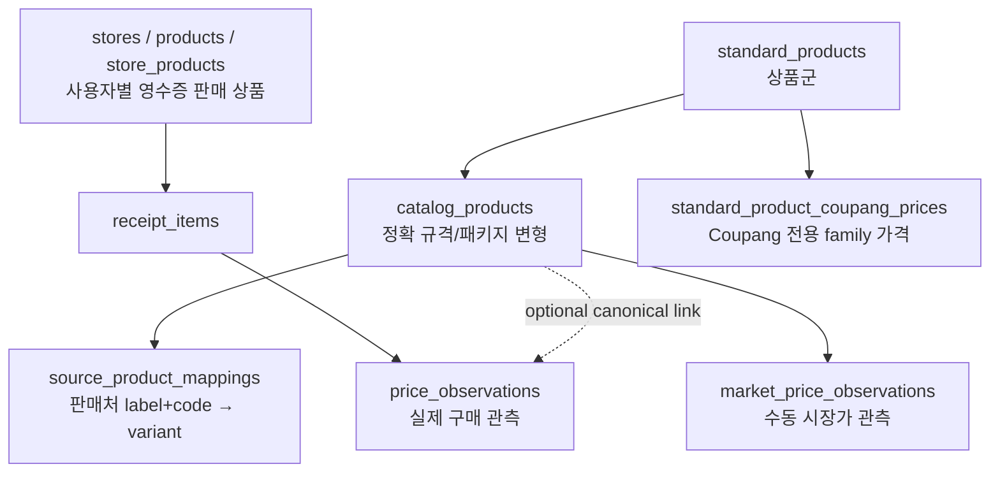
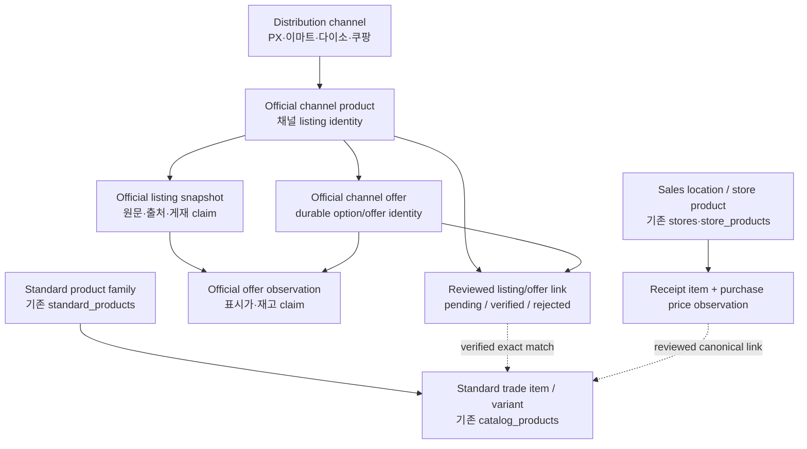

# PriceTrace 공식 유통채널 상품 데이터 모델 설계

> 상태: 교차 검토와 PX 전체상품 snapshot 검증을 반영한 source contract. DB import 계약은 아직 확정하지 않았고, 현재 런타임은 별도의 read-only 공개 투영만 사용한다.
>
> 기준 코드: `feat/px-official-catalog`
>
> 조사 원칙: 기존 코드·migration·타입·공개 영수증 계약과 `official-channel-catalog.v1` PX 전체상품 snapshot을 근거로 한다. DB migration은 실행하지 않았고 기존 표준 상품·영수증 데이터는 수정하지 않았다.

## 1. 결론

PX 공식 사이트 수집 데이터를 기존 `OfficialProductRecord`, `source_product_mappings`, `store_products`, `price_observations` 중 어느 하나에 바로 넣으면 안 된다.

현재 PriceTrace에는 다음 두 단계가 이미 있다.

1. `standard_products` 상품군과 `catalog_products` 정확 규격 변형
2. `store_products`·`receipt_items`·`price_observations` 영수증 기반 실제 구매 관측

그 사이에 **공식 유통채널 listing과 그 재수집 snapshot**이 없다. 신규 데이터는 기존 영수증과 표준 상품을 수정하지 않는 별도 source contract로 먼저 보존하고, 표준 상품 연결은 사람 검토 후 별도 상태로 관리하는 것이 최소 변경이자 가장 안전한 방향이다.

권장 source contract는 [official-channel-catalog.v1.schema.json](./official-channel-catalog.v1.schema.json)이다.

## 2. 확인 범위와 한계

### 확인한 것

- 현재 로컬 `main`과 `origin/main`은 `b1894b58`에서 일치했다.
- `src/domain`, `src/repositories`, `src/app`, `supabase/migrations`, Supabase Edge Function, 공개·demo JSON을 조사했다.
- 공개 영수증 검증은 영수증 4건, 배분 가능한 관측 223건으로 통과했다.
- private 영수증의 값은 노출하지 않고 `receipt.v2` 구조만 확인했다.
- PX 공식 사이트의 `마트 판매상품 > 전체상품` 46페이지에서 listing 2,269개를 수집한 snapshot을 검증했다.
- source product code 2,269개가 고유하며, 상품명·업체명·규격·표시 판매가와 이미지 evidence를 원문 및 hash와 함께 보존했다.
- channel은 `국군복지단 PX`, coverage는 `welfare.mil.kr|mart-sale-products|all-products` collection으로 확정했다.

### 확인하지 못한 것

- 원격 Supabase가 로컬 20개 migration과 완전히 일치하는지는 조회하지 않았다.
- 각 PX 지점의 실제 판매 여부·재고·구매 여부는 공식 상품 목록에 나타나지 않는다.
- 업체명이 제조사 또는 브랜드라는 근거, 규격 원문의 구조화 단위, 공식 상품과 기존 표준 상품의 동등성은 확인하지 못했다.
- 공식 이미지의 재배포 권한은 확인하지 않았다. 공개 투영은 비공개 이미지 파일을 복사하지 않고 snapshot에 기록된 공식 URL만 사용한다.

따라서 업체명은 `vendorNameRaw`, 상품명과 규격은 source raw field로만 투영한다. 표시 판매가는 공식 사이트 관측가이며 영수증 실구매 관측가와 합치지 않는다. 브랜드·제조사·카테고리·지점·재고·표준 상품 link는 만들지 않는다.

## 3. 현재 구조



### 3.1 표준 상품 계층

`standard_products`는 migration 주석과 UI에서 상품군으로 정의된다. `catalog_products`가 실제 판매 규격과 패키지 변형이다.

| 계층 | 현재 필드 | 의미 |
|---|---|---|
| `standard_products` | canonical name, brand, 대표 URL, category, status | 햇반 같은 상품군 |
| `catalog_products` | canonical name, specification, content amount/unit, package count, listing URL | 210g × 3 같은 정확 규격 |
| `standard_product_images` | family당 1개 대표 이미지 | 검토 후 선택된 대표 projection |

사용자가 정의한 “표준 상품”에는 용량·규격·변형·GTIN이 포함된다. 현재 DB 명칭과 정확히 일치하지 않는다. 기존 데이터 보존을 우선하면 **표준 계층 안에 family와 trade item/variant 두 수준이 있다**고 해석해야 한다.

### 3.2 영수증 계층

`receipt.v2` 원본은 문서·판매자·전체 line·identifier·금액·결제를 보존한다. 앱 projection은 KRW, 판매자, 발행일, 합계가 있고 `each` 양의 정수 상품 line만 가격 관측으로 만든다.

영수증 가격은 `net_amount_minor / quantity`로 계산한 **실제 구매 line 관측가**다. 공식 사이트의 표시 가격과 같은 출처가 아니다.

공개 projection은 다음 패턴을 가진다.

- 공개 영수증 snapshot과 상품 관측 bundle 분리
- `receiptId`·`receiptItemId`로 1:1 연결
- source index revision과 파생 관측 revision 검증
- 거래·결제·OCR·원본 파일 관련 금지 정보 제거

이 패턴의 “불변 snapshot + 파생 observation + 명시적 link”는 신규 공식 채널 데이터에도 재사용할 가치가 있다.

### 3.3 현재 “공식 상품” 기능

현재 `OfficialProductRecord`는 유통채널 공식 입점상품이 아니다. 영수증 후보를 제조사 페이지·공식몰 URL과 연결하는 레거시 보조 정보다.

- 공식 이름·URL·출처명·이미지·match metadata·updatedAt만 저장한다.
- seed는 제조사/공식몰 페이지다.
- 관리자 후보는 공개 영수증 `ProductGroup`에서만 생성된다.
- 공식 사이트에만 있고 아직 영수증이 없는 상품은 현재 대기열에 진입할 수 없다.
- localStorage, seed, UI가 서로 다른 key 규칙을 사용한다.
- 공식 URL 하나로 그룹을 합칠 수 있어 한 페이지의 여러 option/SKU가 섞일 수 있다.

따라서 기존 `OfficialProductRecord`와 `official-products.sample.json`을 확장하는 방식은 거부한다.

## 4. 발견한 핵심 문제와 반증

### 4.1 제안된 3계층만으로는 규격 정확성이 부족하다

공식 채널 listing을 `standard_products` family에 바로 연결하면 100ml/500ml, 단품/묶음이 같은 상품군 아래에서 섞인다. 가격 비교까지 하려면 검토 완료 연결 대상은 원칙적으로 `catalog_products` exact variant여야 한다.

family만 확인되고 규격이 불명확한 경우에는 family 후보까지만 보존하고 exact link는 `pending`으로 남겨야 한다.

### 4.2 `source_product_mappings`는 공식 listing 원본이 아니다

현재 identity는 `(source_label, source_product_code)`이며 다음 정보가 없다.

- stable channel ID와 code namespace
- 공식 사이트 원본 상품명·카테고리·규격
- source URL·수집 run·수집 시각·원문 hash
- catalog 게재/중단 상태
- 지점 범위와 재고 상태
- 재수집 이력

이 테이블은 사람 검토가 끝난 호환 projection으로는 쓸 수 있지만 수집 source of truth로는 부족하다.

### 4.3 채널과 지점이 free text로 섞여 있다

`stores.name`, `source_label`, `location_label`, `seller_name` 사이에 공통 channel/location FK가 없다. PX 공식 listing을 지점별 `source_label`로 복제하면 공식 카탈로그 게재를 특정 지점 판매·재고 증거처럼 보이게 만든다.

### 4.4 가격 모델이 세 갈래이며 공통 출처 모델이 없다

| 테이블 | 출처 | 연결 대상 | 핵심 의미 |
|---|---|---|---|
| `price_observations` | 영수증 | receipt item + optional variant | 실제 구매 관측 |
| `market_price_observations` | 수동 확인 시장가 | variant | 판매자 표시가 |
| `standard_product_coupang_prices` | Coupang | family | Coupang 전용 표시가 |

PX 공식 가격은 이 중 어느 것도 아니다. channel listing/offer에 종속된 별도 관측이어야 하며, 가격이 사이트에 없으면 listing은 저장하되 price 배열은 비워야 한다.

### 4.5 현재 등록 RPC는 신규 수집에 재사용할 수 없다

활성 RPC는 표준 family, exact variant, 영수증 판매처 mapping, Coupang URL·가격·수량을 한 번에 요구하고 mapping을 즉시 `verified`로 바꾼다.

PX 공식 listing만 수집할 때 이 RPC를 호출하면 다음 중 하나가 발생한다.

- 존재하지 않는 Coupang 정보를 만들어냄
- 공식 channel 등록을 특정 영수증 판매처/지점 mapping으로 오해
- 기존 verified mapping을 새 variant로 덮어씀

신규 수집 경로는 이 RPC와 완전히 분리해야 한다.

### 4.6 자동 매칭 보호가 충분하지 않다

정확 seller+code 매핑과 shared namespace 보호는 유지할 가치가 있다. 그러나 현재 seed discovery는 namespace+code 또는 높은 상품명 token overlap을 자동 후보로 만들며, official URL 하나로 여러 그룹을 합칠 수 있다.

PX 사이트 code와 receipt `merchant_sku`가 같은 code system이라는 증거가 없으면 두 값을 같은 receipt compatibility namespace(`catalogNamespace`)로 취급하면 안 된다.

### 4.7 계약 drift가 있다

- `receipt.v2` Zod object는 strict가 아니어서 미등록 필드를 조용히 제거할 수 있다.
- `schemas/receipt.schema.json`은 현재 `receipt.v2`가 아닌 legacy 형식이다.
- receipt item ID 규칙이 코드, 공개 projection, DB, `AGENTS.md` 사이에서 다르다.
- 수동 `database.types.ts`는 migration의 여러 table/column을 누락하며 Supabase client도 해당 타입을 사용하지 않는다.
- public catalog Zod는 strict이므로 기존 RPC row에 새 필드를 추가하면 전체 parse가 실패할 수 있다.

그러므로 신규 계약은 기존 JSON/RPC를 제자리 확장하지 말고 별도 version으로 시작해야 한다.

### 4.8 기존 삭제 정책은 evidence 보존에 맞지 않는다

현재 catalog·image·Coupang·mapping·시장가격 관계에는 `ON DELETE CASCADE`가 섞여 있다. 신규 공식 source evidence까지 같은 삭제 정책을 적용하면 표준 상품 정리 과정에서 수집 원문과 가격 이력이 함께 사라질 수 있다.

공식 collection run·source evidence·listing/offer snapshot은 표준 상품 link보다 수명이 길어야 한다. 표준 link가 해제되더라도 evidence는 남기고, 신규 evidence FK에는 `restrict` 또는 감사 대상을 보존하는 nullable link를 써야 한다.

## 5. 권장 계층 구조



사용자 관점에서는 여전히 세 층으로 설명할 수 있다.

1. 표준 상품 계층
   - family
   - exact trade item/variant
2. 공식 유통채널 상품 계층
   - durable listing identity
   - durable offer/option identity
   - append-only listing/offer observations
3. 실제 판매 관측 계층
   - location/store product
   - receipt item
   - purchase price observation

내부적으로 1번과 2번을 세분화해야 기존 데이터와 가격 정확성을 모두 보존할 수 있다.

## 6. 공통 JSON 형식

### 6.1 목적

`official-channel-catalog.v1`은 **수집 source contract 설계안**이다.

- 한 파일은 한 collection run의 불변 snapshot이다.
- PX 전용 필드명 없이 다른 유통채널에 재사용한다.
- 원본 문자열과 source-native identifier를 보존한다.
- catalog 게재, 재고, 가격, 지점 범위를 별도 claim으로 저장한다.
- 표준상품 link나 DB UUID를 포함하지 않는다.
- 재수집 때 기존 파일을 overwrite하지 않고 새 snapshot을 만든다.

### 6.2 상위 구조

```text
schema_version
snapshot
  id, previous_snapshot_id, captured_at, capture_method
  coverage(scope kind/key, completeness proof, counts, pagination)
  collection_status, errors
  collector, reproducible content_hash, notes
channel
  stable internal id, source-facing name, kind, optional operator
sources[]
  optional URL or captured artifact, retrieval time, source-declared date
  authority relation, access scope
  evidence status, hash basis, media metadata, sanitization result
listing_snapshots[]
  observed_at and source refs
  source-native identity with explicit namespace/source
  exact raw source fields
  extraction metadata
  catalog publication claim
  source images
  zero or more offer observations
  reproducible record hash
extensions
```

JSON Schema는 객체 구조와 필드 수준 조건을 검증한다. bundle 전체의 참조·중복·hash·시간 정합성은 아래 semantic invariant까지 함께 통과해야 한다.

### 6.3 두 단계 검증 계약

1단계는 Draft 2020-12 JSON Schema 검증이다. 구현 시 `uuid`, `uri`, `date`, `date-time`의 `format`을 annotation이 아니라 assertion으로 동작시키는 validator 설정을 테스트로 고정해야 한다.

2단계는 bundle semantic validator다. 최소한 다음을 모두 검사한다.

- `sources[].id`, listing UUID, offer UUID의 bundle 내 유일성
- 단수 `source_ref`와 복수 `source_refs`의 모든 값이 정확히 하나의 `sources[].id`를 참조하는지
- child claim의 refs가 enclosing offer/listing refs에 포함되고, parent refs가 실제 identity/field/claim 중 하나를 뒷받침하는지
- durable listing identity tuple이 bundle 안에서 유일하고 `coverage.collected_listing_count`가 그 tuple 수와 같은지
- full 판정 시 expected/collected listing 수와 expected/collected page 수가 각각 같고 `pagination_exhausted = true`인지
- source artifact/raw payload, downloaded image bytes, listing record, 전체 bundle의 SHA-256이 선언한 대상과 일치하는지
- `source_identity.basis = identifier`일 때 정확히 하나만 `is_identity_basis = true`인지
- `previous_snapshot_id`가 같은 channel과 같은 coverage scope의 직전 accepted snapshot인지
- 둘 다 date면 달력 날짜로, 둘 다 date-time이면 UTC instant로 `valid_from <= valid_until`인지. 정밀도가 섞이면 자동 비교하지 않고 review로 보내는지
- 동일 `snapshot.content_hash` 재import가 새 row를 만들지 않는지

JSON Schema만 통과한 파일을 “검증 완료”로 간주하면 안 된다.

full coverage의 completion basis는 다음 truth table을 따른다. 모든 경우에 scope가 결정적이고, coverage refs가 captured evidence를 가리키며, count/page equality와 오류 0건이 선행조건이다.

| `completion_basis` | 추가 증거 |
|---|---|
| `source_complete_export` | 공식 source가 완전 export라고 명시한 artifact |
| `reported_count_matched` | source가 보고한 총 record 수와 수집 고유 tuple 수 일치 |
| `pagination_exhausted` | 마지막 page/cursor 종료 증거와 page 수 일치 |
| `single_source_exhausted` | coverage source 1개, expected/collected page 모두 1 |
| `manual_verified` | 검토자·시각·근거 artifact를 가진 명시적 audit |

### 6.4 식별 규칙

listing identity 우선순위는 다음과 같다.

1. 공식 source가 명시한 product code와 그 source-system namespace
2. 공식 source가 직접 선언한 canonical/API identity URL
3. GTIN·barcode·model 등 source identifier
4. 어느 것도 없으면 snapshot 내부 `record_local`

source product/offer code는 단순 문자열이 아니라 `value + namespace + source_ref`다. namespace가 확인되지 않으면 code를 보존할 수는 있어도 code 기반 cross-snapshot identity로 쓰지 않는다. canonical identity URL도 `canonical_url_source_ref`를 반드시 가진다.

durable listing key의 논리적 tuple은 다음과 같다.

```text
channel.id
+ identity basis
+ source-system namespace 또는 identifier scheme
+ source가 선언한 exact identity value
```

collector가 임의로 query 제거, trailing slash 변경, 대소문자 변경을 한 URL은 identity로 확정하지 않는다. URL alias나 channel ID 변경은 source snapshot을 덮어쓰지 않고 별도 reviewed alias로 관리한다.

identifier는 `scheme + namespace + value + source_ref`를 보존한다. identity 기반이면 `is_identity_basis = true`인 identifier가 정확히 하나여야 하고 durable tuple에는 issuer 이름이 아니라 stable namespace를 사용한다. `record_local`은 저장을 막지 않지만 같은 snapshot 내부에서만 유효하다. 상품명은 identity가 아니다.

offer의 cross-snapshot tuple은 verified listing key에 다음 중 하나를 더한다.

- source offer code
- source offer code가 없으면 각 option의 source ref를 포함한 이름과 값의 exact pair 정렬값
- 둘 다 불충분하면 `record_local`

UUID는 관측 event 식별자이며 durable 상품 key가 아니다. 같은 bundle의 재처리는 `snapshot.content_hash`로 idempotent하게 처리한다.

receipt `merchant_sku`와의 namespace 호환성은 raw source JSON에 넣지 않는다. 별도 review layer에서 증거와 함께 결정하고, 기존 demo의 `korean-military-px`를 자동 전파하지 않는다.

### 6.5 원본값과 정규화값

수집 파일에는 다음 원본값만 둔다.

- `source_name`
- `source_brand`
- `source_manufacturer`
- `source_category_path`
- `source_specification_text`
- `source_description`
- `raw_attributes`

표준명, 정규화 브랜드, category ID, `standard_product_id`, `catalog_product_id`는 source 파일에 쓰지 않는다. 별도 review layer에서 proposal과 최종 link를 관리한다.

각 공통 source field는 `field_sources`에서 claim별 근거를 가진다. 여러 공식 source를 한 listing으로 합치더라도 어느 source가 name/brand/specification을 제공했는지 복원할 수 있어야 한다.

`raw_attributes`는 object가 아니라 순서와 중복 label을 보존하는 `{source_label, source_value, source_ref}` 배열이다. 규격·가격을 구조화할 때도 `source_text`와 claim별 `source_refs`를 함께 보존한다. 구조화 실패는 `null`; 미표시 가격은 `0`이 아니다.

source가 날짜만 제공하면 날짜만 저장하고 시각·timezone을 만들지 않는다. `published`, `valid_from`, `valid_until`은 원본 정밀도에 따라 ISO date 또는 date-time을 받는다.

### 6.6 게재·재고·지점 규칙

- `publication.status = listed`는 공식 카탈로그에 보였다는 뜻만 가진다.
- `publication.status = delisted`는 source가 중단을 직접 명시하고, non-empty `source_text`와 captured evidence가 있을 때만 허용한다.
- `availability.status`는 별도 값이며 근거가 없으면 `unknown`이다.
- 기본 지점 범위는 `channel_unspecified`다.
- `named_locations`는 공식 source가 지점 code/name을 명시한 경우에만 사용하며 `source_code`, `source_name`, `source_ref`를 분리한다.
- 공식 listing 자체는 실제 구매, 특정 지점 판매, 현재 재고를 증명하지 않는다.

상품 부재를 근거로 한 lifecycle event는 raw source JSON의 `delisted`가 아니다. 향후 derived layer에서 아래 조건을 모두 만족할 때만 판단 후보로 만든다.

```text
coverage.completeness = full
AND collection_status = completed
AND entire_channel 외 scope_key가 non-null이며 이전 snapshot과 동일
AND expected/collected listing count 일치
AND expected/collected page count 일치
AND pagination_exhausted = true
AND coverage sources가 captured evidence
AND errors = []
AND bundle semantic validation 성공
```

마지막 present snapshot 뒤에 같은 scope의 accepted full snapshot 두 번 연속으로 해당 durable identity가 없을 때만 absence-based delisting review 후보를 만든다. 이것도 자동 확정이 아니라 derived review event다.

### 6.7 가격 규칙

- price는 offer 안의 append-only observation이다.
- `amount_minor`는 IEEE-754 손실을 막기 위해 JSON wire에서는 부호 없는 10진 정수 문자열로 저장하고 통화와 함께 존재해야 한다. 예: `"13500"`.
- regular/sale/member/promotion/shipping을 분리한다.
- 원문 가격, 적용 조건, 해당 claim의 `source_refs`를 보존한다.
- 영수증 실구매가와 합치거나 대체하지 않는다.
- price가 없거나 읽히지 않으면 `prices: []` 또는 nullable parsed amount를 사용한다.
- 향후 DB에서는 여러 통화를 고려해 기존 KRW 32-bit integer를 그대로 재사용하지 않고 lossless `bigint/numeric + currency`로 투영한다.

### 6.8 출처·증거 규칙

- 모든 coverage, identity, source field, raw attribute, publication, image, quantity, price, availability, listing, offer의 `source_ref`/`source_refs`는 같은 bundle의 `sources[].id`를 가리켜야 한다.
- 단수 `source_ref`도 같은 규칙을 적용하며, child claim ref는 enclosing offer/listing refs의 부분집합이어야 한다.
- `retrieved_at`, 사이트의 `published`, listing/offer `observed_at`을 구분한다.
- web/API source는 HTTP(S) URL을 요구하지만, export/document는 실제 URL이 없으면 artifact/raw payload로 증명할 수 있다.
- `evidence_status = captured`이면 artifact bytes 또는 sanitized raw payload가 있어야 하고, 대상과 hash basis가 명시된 SHA-256이 필수다.
- artifact byte hash는 원본 저장 byte를, raw payload hash는 RFC 8785 canonical JSON을 대상으로 한다.
- image hash가 있으면 HTTP response로 저장한 image bytes를 대상으로 하고 `downloaded_bytes` basis와 byte length를 함께 저장한다.
- listing `record_hash`와 bundle `content_hash`도 RFC 8785를 사용하며 각각 자기 hash member를 제외한다.
- source evidence에는 media type, encoding, byte length, storage access class, sanitization/credential/개인정보 scan 결과를 둔다.
- 인증 header, cookie, token, 계정 정보는 저장하지 않는다.
- hash는 `sha256:<64 lowercase hex>`를 사용한다. 현재 공개 영수증의 16자리 custom revision을 증거 hash로 재사용하지 않는다.
- authenticated/restricted 원본과 artifact는 Git 제외 private 저장소에 두고, 공개 projection만 별도 생성한다.

### 6.9 source contract에 의도적으로 없는 것

- `standard_product_id`
- `catalog_product_id`
- 자동 확정된 normalized name
- receipt `store_id`, `receipt_id`, `receipt_item_id`
- receipt purchase price
- 추정 지점 재고
- 추정 manufacturer/brand/GTIN

이 부재가 자동 연결과 출처 혼합을 막는 안전장치다.

## 7. 향후 DB projection

아래는 구현 방향이며 migration 제안 SQL이 아니다.

| 신규 개념 | 역할 | 변경 성격 |
|---|---|---|
| `distribution_channels` | stable channel identity | 신규 |
| `official_channel_collection_runs` | coverage·collector·오류·bundle hash | 신규 |
| `official_source_evidence` | 공통 source/artifact metadata와 접근 등급 | 신규 |
| `official_channel_products` | channel-native durable listing identity | 신규 |
| `official_channel_product_snapshots` | append-only raw fields·publication, collection run 참조 | 신규 |
| `official_channel_offers` | listing 아래 durable source offer/option identity | 신규 |
| `official_channel_offer_observations` | offer의 표시가·재고 claim 이력 | 신규 |
| `official_channel_product_links` | listing-level family/variant 후보와 review audit | 신규 |
| `official_channel_offer_links` | offer-level exact variant 후보와 review audit | 신규 |

원본 bundle 전체를 `official_channel_collection_runs`에 immutable JSONB/artifact로 보존하고 listing snapshot이 run을 참조하는 방식도 가능하다. 어느 방식을 택하든 공통 source evidence를 listing마다 복사하지 않는다.

`sources[].id`는 bundle-local이므로 DB의 `official_source_evidence` 기본키는 `(collection_run_id, source_id)` 복합키여야 한다. listing/offer/price/availability 등 normalized claim의 source junction도 `collection_run_id`를 함께 저장하고 이 복합키를 FK로 참조한다. 전역 `source_id` 단독 FK는 금지한다.

한 listing에 규격이 다른 offer가 둘 이상 있으면 listing 자체를 하나의 `catalog_products`에 연결하지 않는다. 가장 작은 stable source identity인 durable offer를 각각 exact variant에 연결한다. stable offer identity가 없으면 exact link는 `pending`으로 남긴다.

### 기존 구조 재사용 원칙

- `standard_products`: family 후보/최종 family 유지
- `catalog_products`: 정확 규격이 확인된 최종 link target
- `source_product_mappings`: receipt code와 channel code가 같은 namespace임이 별도 검증된 뒤에만 compatibility projection 생성. 기존 target과 충돌하면 upsert하지 않고 review로 중단
- `standard_product_images`: 공식 source 이미지를 자동 복사하지 않고 검토 후 대표 이미지로 승격
- 기존 public catalog RPC: shape 유지

### 재사용 금지

- official listing을 `store_products`로 저장
- official price를 receipt `price_observations`로 저장
- PX 데이터를 `standard_product_coupang_prices`에 저장
- official source 원본 대신 `source_product_mappings`만 저장
- 기존 등록 RPC로 자동 import

### 보존·공개 원칙

- collection run, raw source, listing snapshot, offer observation은 admin/service insert만 허용하고 update/delete는 금지한다.
- 정정은 기존 evidence update가 아니라 새 snapshot 또는 review event로 남긴다.
- authenticated/restricted artifact는 anon RPC와 공개 bundle에서 제외한다.
- public RPC는 reviewed projection만 반환한다.
- evidence FK 삭제는 cascade를 피하고 `restrict` 또는 감사 대상을 보존하는 정책을 사용한다.
- `channel.id`는 첫 accepted snapshot 이후 변경하지 않는다. rename은 display name 변경, channel merge/split은 reviewed alias/event로 기록한다.
- 보안 사고·자격증명 노출·법적 삭제 의무는 일반 delete가 아닌 권한 제한된 quarantine/purge 절차와 감사 event로 처리하고, 허용되는 범위에서 비민감 hash·사유를 보존한다.

## 8. 최소 변경 구현 순서

현재 1~5단계의 최소 공개 조회 경로까지만 구현한다.

1. 완료: PX 전체상품 snapshot과 source-ref/hash/coverage 정합성 검증
2. 완료: Git 제외 private 경로에 source snapshot과 이미지 evidence 보존
3. 완료: `channel = 국군복지단 PX`, `coverage = 마트 판매상품 전체상품 collection`으로 의미 확정
4. 완료: 원문 필드·표시가·공식 이미지 URL·미연결 상태만 담은 versioned 공개 투영 생성
5. 완료: 상품 페이지의 별도 `PX 공식 판매상품` 보기에서 read-only 표시
6. 미구현: link contract와 RLS/delete/visibility matrix 설계
7. 미구현: additive channel/run/source/listing/snapshot/offer/link DB migration dry review
8. 미구현: pending link proposal과 사람 검토
9. 미구현: verified link만 기존 표준 상품 projection에 연결
10. 미구현: 동일 scope의 반복 snapshot을 이용한 가격 이력·등재 종료 판정

## 9. 구현 전 결정해야 할 사항

1. 현재 `standard_products` family + `catalog_products` exact variant 의미를 유지할지
2. 공식 listing과 표준 상품의 연결 검토를 누가 승인하고 어떤 근거를 필수로 할지
3. 이후 PX snapshot도 같은 `마트 판매상품 > 전체상품` scope로 반복 수집할지
4. PX 공식 code의 source-system namespace와 receipt `merchant_sku` namespace가 같다는 별도 증거가 있는지
5. source code가 없을 때 source-declared canonical/API identity URL만 provisional identity로 허용할지
6. 가격 없는 공식 listing도 저장할지
7. regular/member/sale/shipping 중 어떤 가격 claim을 수집할지
8. 인증된 source artifact의 private 저장 위치, 보존 기간, 접근 권한, 공개 projection 범위
9. category/search/전체 채널별 full 판정과 count/pagination 완료 증거
10. family-level 후보는 허용하되 exact variant 미확정 상태로 둘지
11. reviewed link의 승인자·근거·rejection·재검토 이력을 어떻게 보존할지
12. 공식 이미지를 대표 이미지로 승격할 때 별도 저작권·HTTPS/rehost 검토 절차를 둘지
13. channel merge/split/alias를 누가 승인하고 기존 durable key를 어떻게 보존할지
14. 보안·법적 사유의 evidence quarantine/purge 권한과 감사 보존 범위

## 10. 실제 구현 시 영향 범위

- `src/domain`: 공개 투영 strict schema, 중복 identity·coverage count invariant
- `src/repositories`: generated public PX catalog loader
- `scripts`: PX scope 정정, RFC 8785 bundle hash, 공개 투영 sync/check
- Git 제외 private source 경로: authenticated/restricted snapshot/index/evidence 정책
- 공개 data 경로: 원문 필드·표시가·공식 이미지 URL·source snapshot hash만 담은 projection
- 상품 UI: 2,269개 검색·정렬·페이지 조회와 `표준 상품 연결 전` 상태 표시
- `supabase/migrations`: channel/collection run/source evidence/listing/snapshot/offer/link 신규 table, RLS, non-cascade 보존 정책
- DB amount type: decimal-string wire를 lossless `bigint/numeric + currency`로 투영
- `src/lib/supabase/database.types.ts`: 자동 재생성 및 typed client 적용
- 관리자 UI: 영수증 연결 대기열과 분리된 공식 listing review
- public API: 기존 strict RPC를 바꾸지 않는 별도 versioned RPC
- UI 문구: 공식 카탈로그 게재, 지점 재고, 영수증 관측가 구분
- tests: format assertion, 재수집 idempotency, source link, hash 변조, coverage mismatch, 미표시 price, code/namespace collision, option 분리, pending link, partial snapshot

## 11. 근거 파일

- `src/domain/receipt.ts:15-135`
- `src/domain/public-receipt.ts:17-120,129-180,209-267`
- `src/domain/public-observation.ts:23-81,102-140,170-229`
- `src/domain/official-product.ts:20-74,95-167`
- `src/domain/product-browser.ts:159-200`
- `src/repositories/official-product.repository.ts:4-35`
- `src/repositories/supabase-settlement.repository.ts:17-33`
- `src/app/page.tsx:46-55,100`
- `src/app/OfficialProductPanel.tsx:48-80,103-116,270-318`
- `src/app/ProductBrowser.tsx:102-176,203-208`
- `src/domain/public-standard-catalog.ts:10-96`
- `supabase/migrations/20260715161910_m3_initial_schema.sql:10-77`
- `supabase/migrations/20260721072756_canonical_catalog_mapping.sql:20-62`
- `supabase/migrations/20260722172257_market_price_comparison.sql:1-59`
- `supabase/migrations/20260723160655_standard_product_hierarchy.sql:1-65`
- `supabase/migrations/20260725180000_standard_product_coupang_prices.sql:1-28`
- `supabase/migrations/20260728160059_coupang_max_bundle_prices.sql:26-510`
- `supabase/migrations/20260728171252_coupang_required_price_quantity.sql:1-373`
